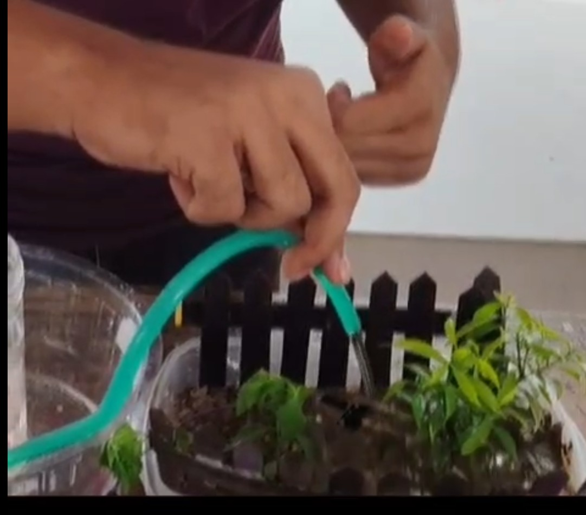
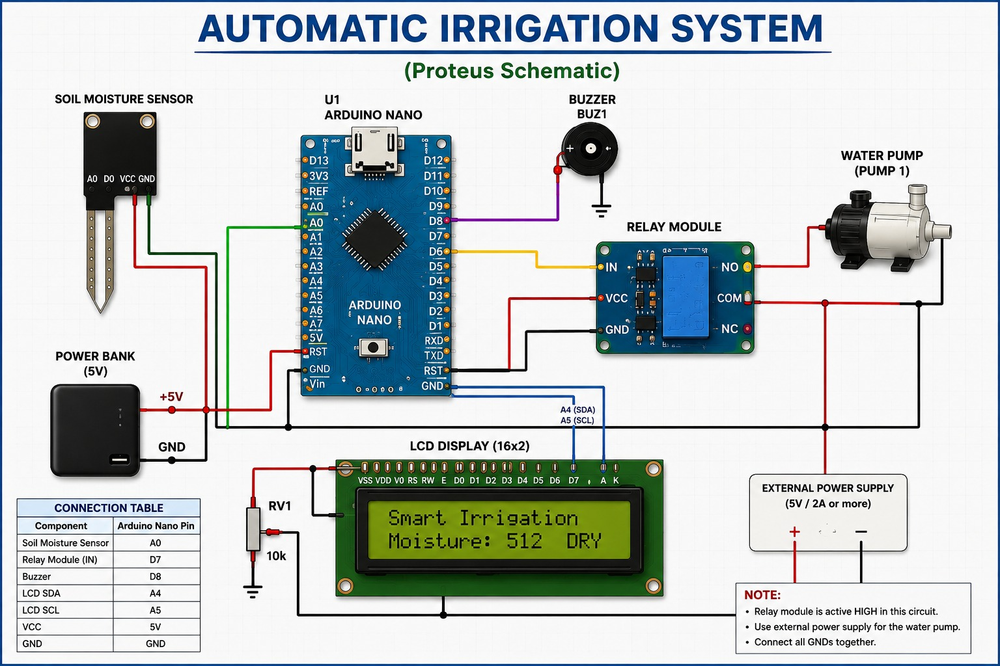
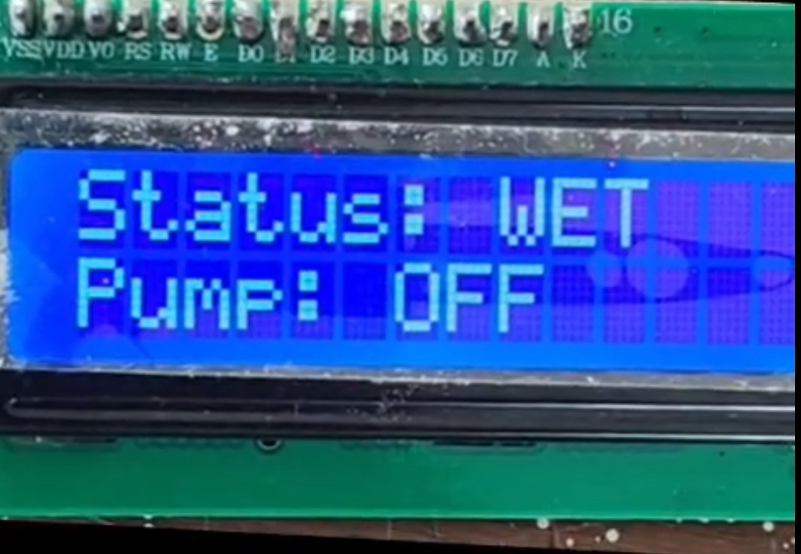
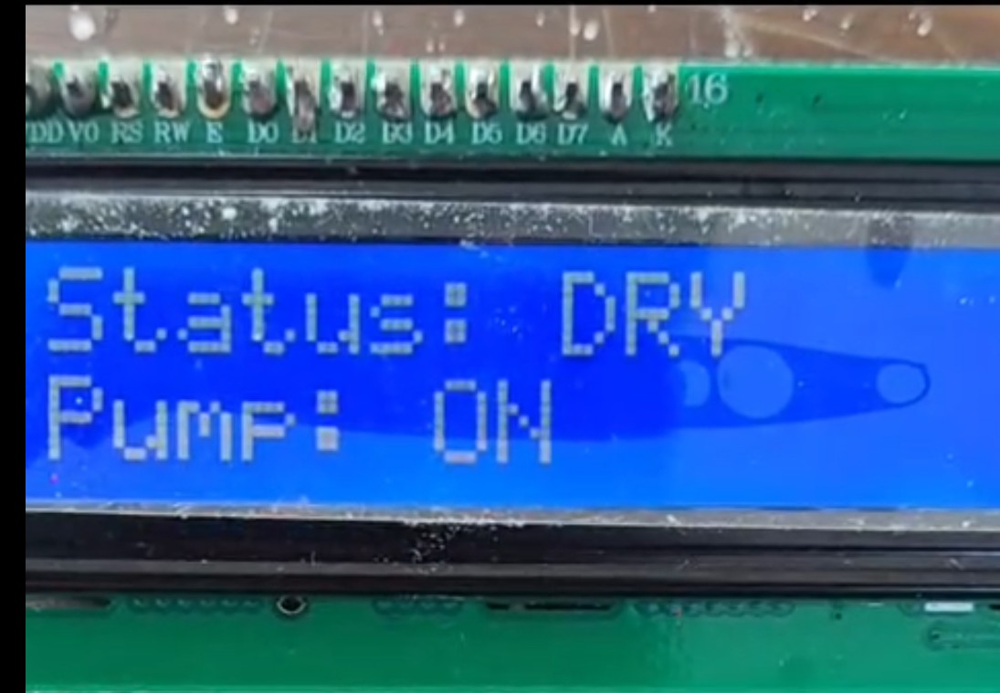
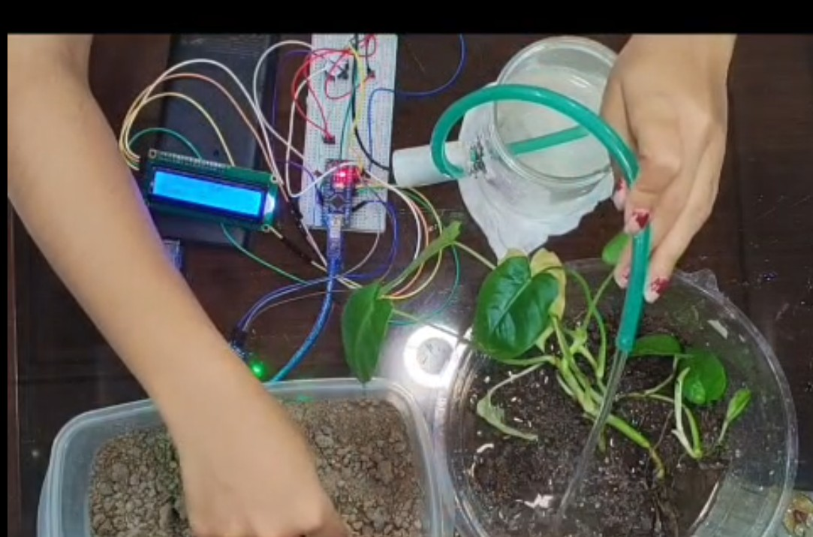

# 🌱 Automatic Irrigation System Using Arduino Nano

An Arduino Nano-based Automatic Irrigation System that automatically monitors soil moisture and controls a water pump, reducing water wastage and minimizing manual effort.

---

## 📖 Overview

This project is designed to automate irrigation using an Arduino Nano and a soil moisture sensor. The system continuously monitors soil moisture and automatically turns the water pump ON when the soil is dry and OFF when the soil becomes sufficiently wet.

This project was developed as part of an academic team project to enhance practical knowledge in Embedded Systems and Automation.

---

## ✨ Features

- Automatic soil moisture monitoring
- Automatic water pump control
- Real-time LCD status display
- Buzzer alert
- Low-cost embedded solution
- Water-saving irrigation system

---

## 🛠 Hardware Components

- Arduino Nano
- Soil Moisture Sensor
- Relay Module
- Water Pump
- 16×2 I2C LCD
- Buzzer
- Jumper Wires
- Power Supply

---

## 💻 Software

- Arduino IDE
- Embedded C (Arduino)

---

## ⚙️ Working Principle

1. The soil moisture sensor continuously reads the moisture level.
2. Arduino Nano processes the sensor value.
3. If the soil is **Wet**:
   - LCD displays **Status: WET**
   - Water pump remains **OFF**
4. If the soil is **Dry**:
   - LCD displays **Status: DRY**
   - Water pump turns **ON**
   - Buzzer provides an alert.
5. The process repeats automatically.

---

# 📷 Project Gallery

## 🌿 Final Project



---

## 🔌 Circuit Model



---

## 💧 Wet Soil Condition

### LCD Display



**Output**

- Status: **WET**
- Pump: **OFF**

### Actual Project


---

## ☀️ Dry Soil Condition

### LCD Display



**Output**

- Status: **DRY**
- Pump: **ON**

### Actual Project



---

## 📂 Repository Structure

```text
Automatic-Irrigation-System/
│
├── Arduino_Code/
│   └── Automatic_Irrigation_System.ino
│
├── Images/
│   ├── circuit_model.jpeg
│   ├── decorated_project.jpeg
│   ├── dry_condition.jpeg
│   ├── dry_lcd.jpeg
│   ├── wet_condition.jpeg
│   └── wet_lcd.jpeg
│
└── README.md
```

---

## 🚀 Future Improvements

- IoT-based monitoring using ESP8266/ESP32
- Mobile application integration
- Cloud data logging
- Solar-powered irrigation
- Multiple soil moisture sensors
- Weather-based irrigation scheduling

---

## 👥 Team

**Team Name:** Eternal Voltage

- Md. Abdullah Al Sami Mirza
- Joyosree Roy Joya
- Puja Banik Trina
- Abdul Hamid
- Fahim Ahmed
- Samia Jannat Ahana

---

## 🙏 Acknowledgements

Special thanks to **Tonmoy Sir** for his valuable guidance and continuous support throughout this project.

---

## 📄 License

This project is developed for **academic and educational purposes**.

---

⭐ If you found this project helpful, please consider giving this repository a star.
